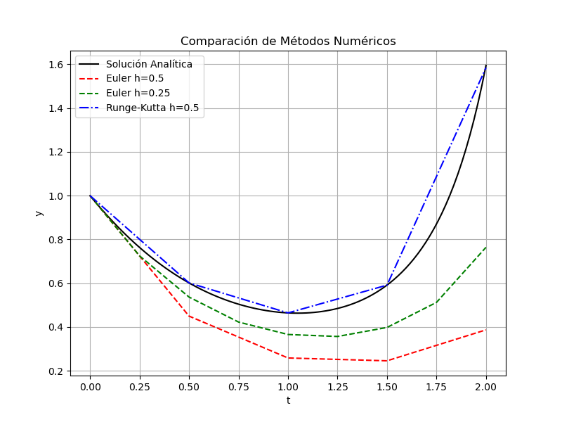
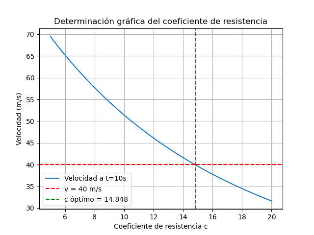

# Tarea 3 - Metodos Numericos

Este directorio contiene una serie de scripts en Python que implementas soluciones a problemas matematicos relacionado con los metodos numericos. A continuación, se describen los archivos y sus funcionalidades principales:

## Archivos y Funciones

### 1. `edo.py`
- Se implementarios las soluciones analiticas, Metodo de Euler y Metodo de Range-Kutta para la siguiente EDO:
    
$$
\frac{dy}{dt} = yt^2 - 1.1y
$$

- Con $y(0) = 1$, en el intervalo de $t \in [0,2] $

- Se generó un gráfico para comparar los resultados:

### 2. `cramer.py`
- Implementa la regla de Cramer para resolver el siguiente sistema de ecuaciones:

$$
0.3x_1 + 0.52x_2 + x_3 = -0.01 \\
0.5x_1 + x_2 + 1.9x_3 = 0.67 \\
0.1x_1 + 0.3x_2 + 0.5x_3 = -0.44
$$

- De donde se obtuvo la siguiente solución:
$$
x_1 = -14.9000 \\
x_2 = -29.5000 \\
x_3 = 19.8000
$$

### 3. `coeficiente_resistencia.py`
- Se implementó un programa que utiliza el método gráfico para determinar el coeficiente de resistencia $c$ necesario para que un paracaidista de masa $m = 68.1$ kg tenga una velocidad de $40$ m/s después de una caída libre de $t = 10$ s. 

- Se obtuvo el siguiente resultado:

## Uso
Cada archivo puede ejecutarse de forma independiente. Se mostrarán los resultados en la salida estándar o en gráficos.

## Requisitos
- Librerías necesarias: `numpy`, `matplotlib`
- Asegúrese de tener instaladas estas librerías antes de ejecutar los scripts.
