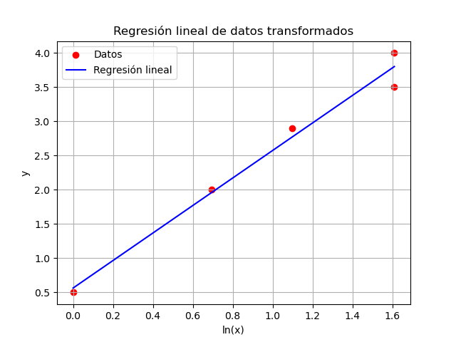

# Tarea 4 - Ajuste de Funciones

El directorio contiene un script, `regresion_lineal.py`, realiza una regresión lineal sobre un conjunto de datos transformados mediante una función logarítmica. Es útil para ajustar modelos que requieren una transformación previa de las variables.

## Descripción del Script

### Funcionalidad
1. **Transformación de datos**:
   - Se aplica una transformación logarítmica a los valores de `x` utilizando la función `np.log`.
   
2. **Regresión lineal**:
   - Se utiliza la función `linregress` de `scipy.stats` para calcular los parámetros de la regresión lineal:
     - Pendiente (`slope`).
     - Intersección (`intercept`).
     - Coeficiente de correlación (`r_value`).
     - Valor p (`p_value`).
     - Error estándar (`std_err`).

3. **Cálculo de parámetros del modelo**:
   - Se calculan los parámetros `a` y `b` del modelo ajustado.

4. **Predicción**:
   - Se realiza una predicción para un valor específico de `x` (en este caso, `x = 2.6`).

5. **Visualización**:
   - Se genera un gráfico que muestra los datos transformados y la línea de regresión ajustada.

### Salida
- Parámetros del modelo ajustado (`a` y `b`).
- Predicción para un valor específico de `x`.
- Gráfico de los datos transformados y la línea de regresión.

## Requisitos
Este script hace uso de las siguientes librerías de Python:
- `numpy`
- `matplotlib`
- `scipy`