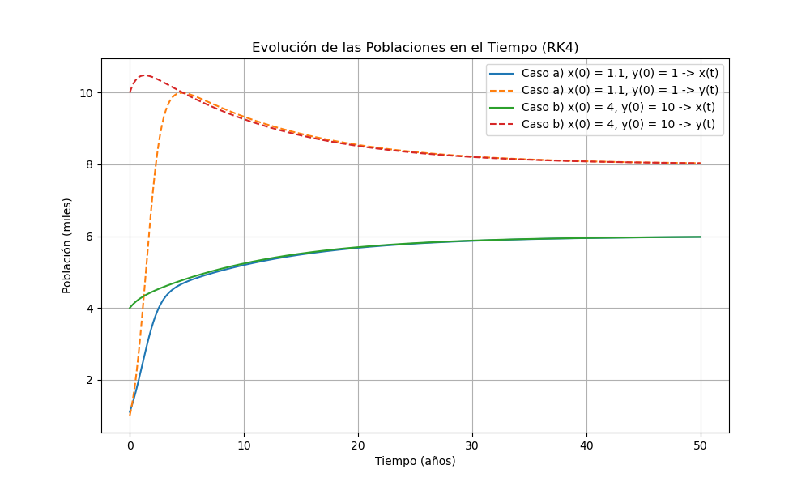
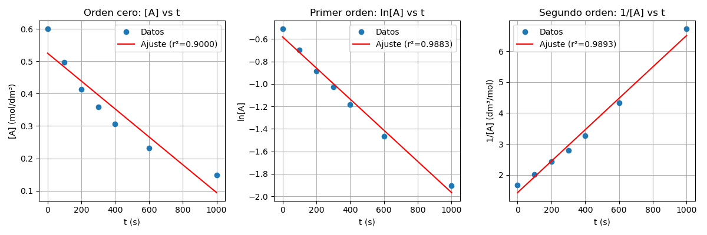
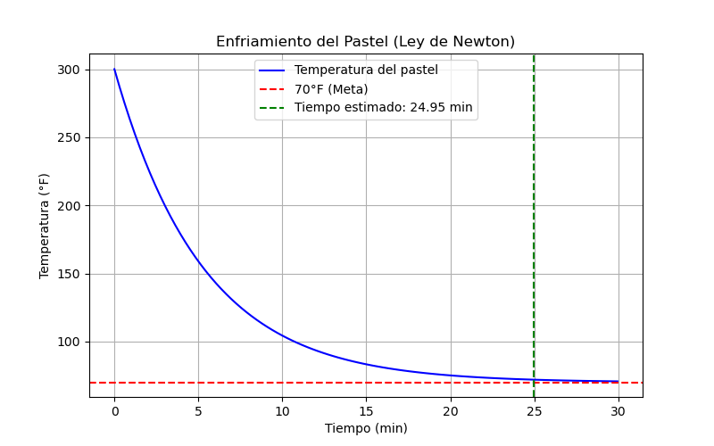

# Tarea 5 - Analisis de datos cineticos

Este directorio contiene varios scripts en Python que implementan modelos de regresion lineal y simulaciones relacionados con reacciones químicas y procesos físicos. A continuación, se describen los archivos y las funciones principales que contienen:

## Archivos y Funciones

### 1. `poblaciones.py`
- **Descripción**: Simula la evolución de dos poblaciones en competencia utilizando un sistema de ecuaciones diferenciales. Para ello define el sistema de ecuaciones diferenciales para las poblaciones. A su vez implementa el método de Runge-Kutta de cuarto orden para resolver el sistema de ecuaciones. Genera un gráfico que muestran la evolución de las poblaciones en el tiempo para diferentes condiciones iniciales.

- **Salida**:

### 2. `orden_ctt.py`
- **Descripción**: Determina el orden de una reacción química (cero, primero o segundo) a partir de datos experimentales. Se realiza el análisis para una reacción de orden cero. Se realiza el análisis para una reacción de primer orden. Se realiza el análisis para una reacción de segundo orden.

- **Salida**: 
  - Determina el mejor ajuste basado en el coeficiente de determinación ($R²$). En particular es de orden dos con el siguiente coeficiente:
  $$
  R² = 0.9893
  $$

  - Calcula la constante de velocidad ($k$) para el orden más adecuado.
  $$
  0.0051 dm³ mol⁻¹ s⁻¹
  $$
  - Gráficos que muestran los ajustes lineales para cada orden de reacción.
  

### 3. `temperatura_pastel.py`
- **Descripción**: Modela el enfriamiento de un pastel a 300 ºC hasta alcanzar una temperatura de 70 ºC sabiendo que luego de tres minutos su temperatura es 200 ºC. utilizando:
$$
\frac{𝑑𝑇}{𝑑𝑡} =𝑘(𝑇−𝑇_𝑚)
$$
Para ello, se calcula la constante de enfriamiento `k` a partir de datos iniciales y luego se estima el tiempo necesario para que el pastel alcance una temperatura objetivo.
- **Salida**: 
  - Imprime la constante de enfriamiento `k` y el tiempo estimado para alcanzar la temperatura objetivo.
  - Genera un gráfico que muestra la curva de enfriamiento del pastel.
   

## Uso
Cada archivo puede ejecutarse de forma independiente. Se mostrarán los resultados en la salida estándar o en gráficos.

## Requisitos
Este directorio utiliza las siguientes librerías de Python:
- `numpy`
- `matplotlib`
- `scipy`

Asegúrate de tenerlas instaladas antes de ejecutar los scripts.